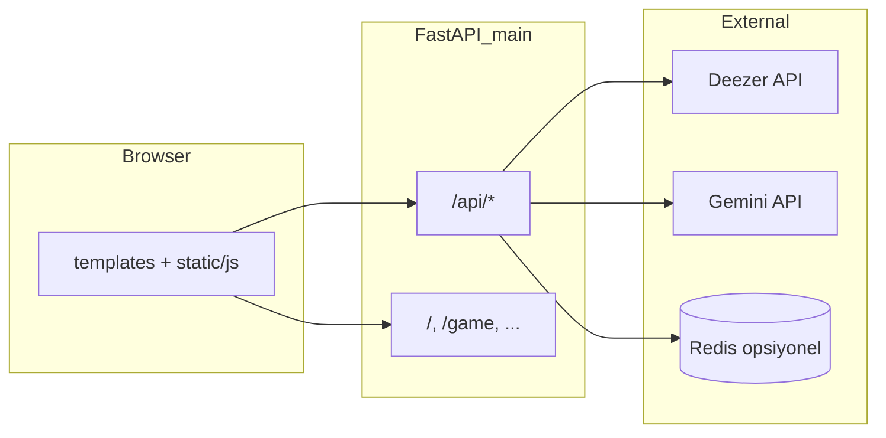

# RitmiQ — Mimari Özet

Tek bir **FastAPI** uygulaması: tarayıcıya HTML sayfaları ve `/static` altında CSS/JS verir; aynı süreçte REST API sunar. Ayrı bir Node/Vite frontend yok.

## Bileşenler ve roller

| Parça | Amaç |
|--------|------|
| `main.py` | Uygulama girişi: route’lar, günlük quiz önbelleği, arka plan döngüsü, static mount. |
| `services/deezer_service.py` | Deezer public API: sanatçı arama, sanatçıya özel quiz üretimi (preview URL + şıklar). |
| `services/gemini_service.py` | Google Gemini: skor değerlendirme mesajı + günlük şarkı listesi (JSON). |
| `templates/*.html` | Sunulan sayfalar (landing, oyun, yasal). |
| `static/` | Stil ve istemci JavaScript. |

## Dış sistemler

- **Deezer API**: Şarkı önizleme, sanatçı/şarkı verisi; API anahtarı gerektirmez.
- **Gemini API**: `GEMINI_API_KEY` ile; günlük mod ve `/api/evaluate` için.
- **Redis** (isteğe bağlı): `REDIS_URL` ile günlük quiz’i sunucular arası paylaşır; yoksa process içi bellek + dosya yolları.

## İstek akışı (yüksek seviye)

## Oyun modları (iş mantığı)

1. **Klasik mod**: İstemci `/api/search` → sanatçı seçer → `/api/quiz?artist_id=...` → Deezer’dan o sanatçıya özel sorular.
2. **Günün ritmi**: Sunucu her gün için Gemini’den TR/GL şarkı listesi alır, Deezer’da eşleştirir, önbelleğe yazar. İstemci `/api/daily` ile aynı gün herkese aynı soru setini alır (önizlemeler istek anında zenginleştirilebilir).

## Önbellek mantığı (günlük quiz)

- Anahtar: `YYYYMMDD` tarih string’i.
- Redis varsa: kalıcı paylaşımlı önbellek; yoksa `main.py` içindeki process belleği.
- Gece yarısı yakınında arka plan görevi yeni gün için üretim yapar; kilit ile çoklu worker çakışması azaltılır.

Bu dosya yalnızca `cenker/` altında dokümantasyondur; çalıştırma komutları `çalıştırma.md` içindedir.
